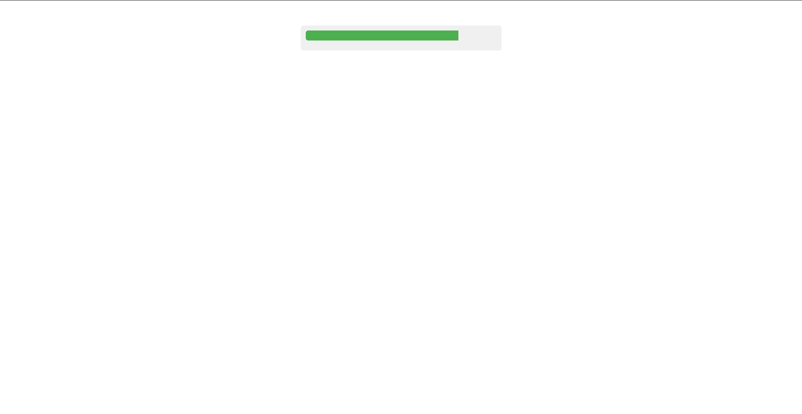

# Segmented Progress Bar

This project demonstrates a segmented progress bar using HTML and CSS, designed to visually represent progress in discrete segments.

## Project Structure

index.html         --> HTML file defining the structure of the progress bar.
styles.css         --> CSS file containing styles for the progress bar and animations.

## Preview

## How to Use

1. **Clone the Repository:**
   
   git clone https://github.com/Yashi-Singh-1/Segmented-Progress-Bar
   

2. **Navigate to the Project Directory:**
  
   cd segmented-progress-bar
   

3. **Open index.html in a Web Browser:**
   Simply open index.html in your preferred web browser to view the segmented progress bar.

## Customization

- **Number of Segments:**
  Adjust the number of segments by adding or removing 

 elements within .segmented-progress in index.html.

- **Progress Animation:**
  Customize the animation duration and segment width progression by modifying the @keyframes segment-grow animation in styles.css.

## Example

To see a working example, check out index.html in your browser after cloning the repository.

## Author

Yashi Singh
